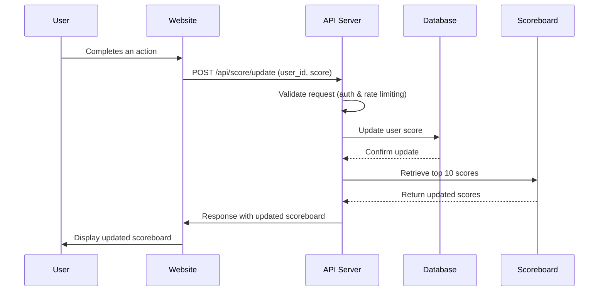

# Scoreboard API Service

## Overview
This module provides an API service for managing and updating a live scoreboard. It allows users to update their scores upon completing an action while ensuring security measures to prevent unauthorized score modifications.

## Features
- Maintains a scoreboard displaying the top 10 user scores.
- Provides a real-time update mechanism for the scoreboard.
- Securely updates user scores upon successful action completion.
- Implements security checks to prevent unauthorized score increments.

## API Endpoints

### 1. Update Score
**Endpoint:** `POST /api/score/update`

**Description:** Updates the user score when an action is completed.

**Request Headers:**
```http
Authorization: Bearer <token>
Content-Type: application/json
```

**Request Body:**
```json
{
  "user_id": "string",  
  "score": "integer"
}
```

**Response:**
```json
{
  "success": true,
  "message": "Score updated successfully",
  "updated_score": 150
}
```

### 2. Get Top Scores
**Endpoint:** `GET /api/score/top`

**Description:** Retrieves the top 10 scores.

**Response:**
```json
{
  "top_scores": [
    { "user_id": "user123", "score": 200 },
    { "user_id": "user456", "score": 190 }
  ]
}
```

## Execution Flow
1. The user completes an action on the website.
2. The website dispatches a `POST` request to `/api/score/update` with the user ID and score increment.
3. The backend verifies the user’s authentication and authorization.
4. The backend updates the user’s score in the database.
5. The system retrieves the top 10 scores and updates the scoreboard in real time.

## Execution Flow Diagram


## Security Considerations
- **Authentication:** API requests require a valid Bearer token.
- **Rate Limiting:** Prevents abuse by limiting the number of score updates per user.
- **Score Validation:** Ensures the new score follows expected increment rules.
- **Logging:** Logs suspicious activity for audit and analysis.

## Possible Improvements
- Implement WebSockets for real-time scoreboard updates.
- Introduce leaderboard caching for optimized performance.
- Add user verification mechanisms (e.g., action validation through cryptographic signatures).